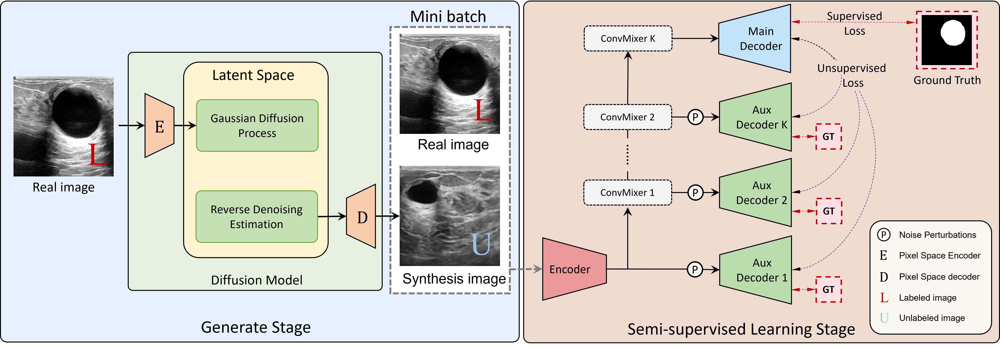
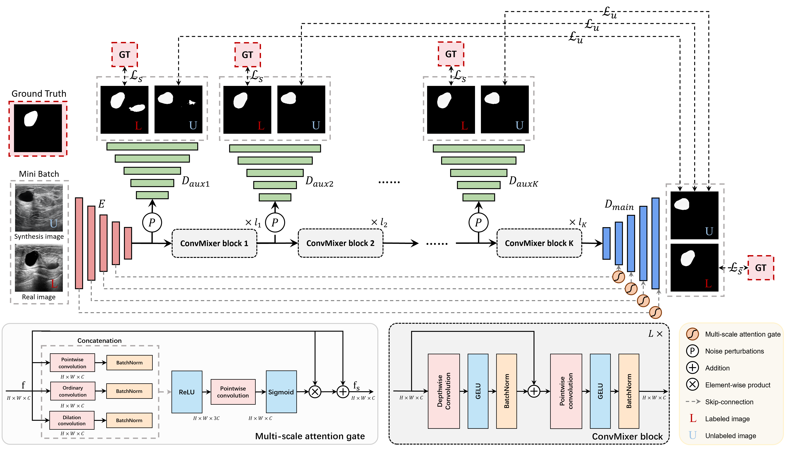

# Multi-Level Global Context Cross Consistency Model for Semi-Supervised Ultrasound Image Segmentation with Diffusion Model

[Paper](https://arxiv.org/abs/2210.13012) | [Code](https://github.com/FengheTan9/Multi-Level_Global_Context_Cross_Consistency)

a Pytorch code base for [Multi-Level Global Context Cross Consistency Model for Semi-Supervised Ultrasound Image Segmentation with Diffusion Model](https://arxiv.org/abs/2210.13012)

## Introduction
Medical image segmentation is a critical step in computer-aided diagnosis, and convolutional neural networks are popular segmentation networks nowadays. However, the inherent local operation characteristics make it difficult to focus on the global contextual information of lesions with different positions, shapes, and sizes. Semi-supervised learning can be used to learn from both labeled and unlabeled samples, alleviating the burden of manual labeling. However, obtaining a large number of unlabeled images in medical scenarios remains challenging. To address these issues, we propose a Multi-level Global Context Cross-consistency (MGCC) framework that uses images generated by a Latent Diffusion Model (LDM) as unlabeled images for semi-supervised learning. The framework involves of two stages. In the first stage, a LDM is used to generate synthetic medical images, which reduces the workload of data annotation and addresses privacy concerns associated with collecting medical data. In the second stage, varying levels of global context noise perturbation are added to the input of the auxiliary decoder, and output consistency is maintained between decoders to improve the representation ability. Experiments conducted on open-source breast ultrasound and private thyroid ultrasound datasets demonstrate the effectiveness of our framework in bridging the probability distribution and the semantic representation of the medical image. Our approach enables the effective transfer of probability distribution knowledge to the segmentation network, resulting in improved segmentation accuracy.

#### MGCC framework:



#### MGCC model



#### **Generation results**

**BUSI Result:**                                  **TUS Result:**

  


## Datasets

Please put the [BUSI](https://www.kaggle.com/aryashah2k/breast-ultrasound-images-dataset) dataset or your own dataset as the following architecture. 
```
├── CMUNet
    ├── inputs
        ├── BUSI
            ├── images
            |   ├── benign (10).png
            │   ├── malignant (17).png
            │   ├── normal (14).png
            │   ├── ...
            |
            └── masks
                ├── 0
                |   ├── benign (10).png
                |   ├── malignant (17).png
                |   ├── normal (14).png
                |   ├── ...
        ├── your dataset
            ├── images
            |   ├── 0a7e06.jpg
            │   ├── 0aab0a.jpg
            │   ├── 0b1761.jpg
            │   ├── ...
            |
            └── masks
                ├── 0
                |   ├── 0a7e06.png
                |   ├── 0aab0a.png
                |   ├── 0b1761.png
                |   ├── ...
```
## Training and Validation

- Generate Stage:

  You can follow this [work]([mueller-franzes/medfusion: Implementation of Medfusion - A latent diffusion model for medical image synthesis. (github.com)](https://github.com/mueller-franzes/medfusion))

- Semi-supervised Learning Stage:

  You can first spilt your dataset:

  ```python
  python spilt.py
  ```

  Then, training your dataset:

  ```python
  python train.py
  ```

## Acknowledgements:

This code-base uses helper functions from [CMU-Net]([FengheTan9/CMU-Net: a pytorch implement of CMU-Net (github.com)](https://github.com/FengheTan9/CMU-Net)) and [SSL4MIS](https://github.com/HiLab-git/SSL4MIS).

## Citation

If you use our code, please cite our paper:

```

```

